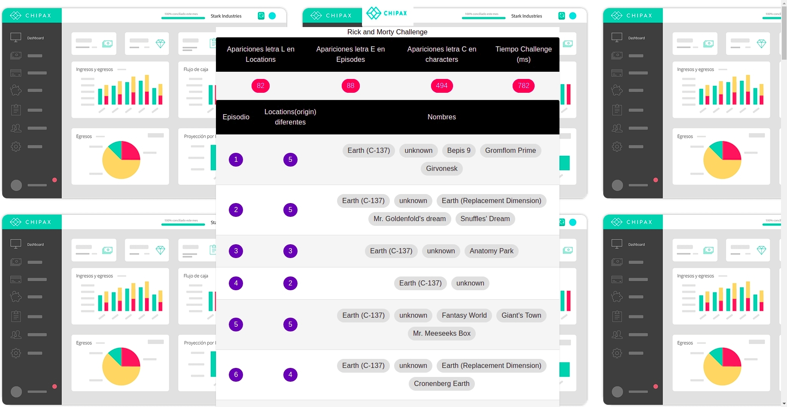

    

# Chipax Challenge

## **¿Te gustaría trabajar en Chipax 🙂?**

Hola 👋, es super simple:

1. resuelve este desafío y súbelo a tu repositorio público (github o similar)
1. mándame un email a [joaquin@chipax.com](mailto:joaquin@chipax.com) con el link a tu solución; contándome:

## Usa la API de Rick and Morty para probar tus habilidades 🥼

Tienes que consultar los `character`, `locations` y `episodes` de [https://rickandmortyapi.com/](https://rickandmortyapi.com/) e indicar:

1. Char counter:
1. Episode locations:

**Usa la tecnología que quieras.**

Nos fijaremos en estas cosas según orden de prioridad:

1. _Código legible_: ya lo sabes, poder leer el código de tu colega es clave porque permite escalar, mantener, encontrar bugs y reutilizar
1. _Diseño de la solución_: quizás te gusta usar un patrón de diseño específico o usar un paradigma especial (OOP, FP, etc.), lo importante es que no sea 🍝
1. _Testing:_ Antes pensábamos que el testing era para otros. Ahora es clave en nuestro workflow
1. _Orden:_ su readme.md, carpetas y archivos fáciles de digerir
1. _Workflow_: \*\*usamos git. queremos ver cómo usas git.
1. _Performance:_ Tu sistema no debería tardar más de ~3 segundos (dependiendo de la conexión a internet)

¡Muchas gracias y éxito! 😄

# Stack of technologies for this challenge:

- Front End:

  - HTML - CSS - Javascript
  - React
  - Material UI
  - Redux

- Back End:
  - Node.js
  - Express
- API:
  - [Rick and Morty](https://rickandmortyapi.com/)

# Project folders:

    .api
    ├── src
        ├── app.js           # Server Port Listen.
        ├── server.js        # Server Configuration and Endpoints.
    ├── tests                # Chai Tests.

    .client
    ├── public               # Static files
    ├── src
        ├── actions          # Redux Actions.
        ├── components       # React Components.
        ├── reducers         # Redux Reducer.
        ├── store            # Redux Store.

# How to start the project:

If you want to see the page for yourself, you'll need to do the following:

- Clone the repository

- Client: yarn, yarn start

- Api: yarn, yarn start and yarn test (chai)

# Previews

### Challenge page:

